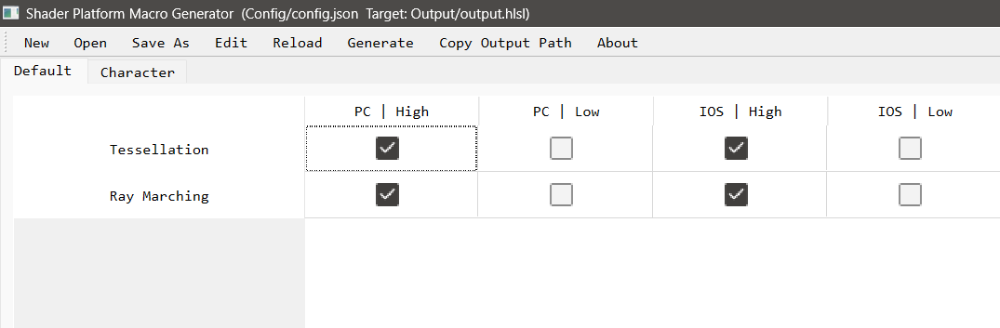

# Shader Platform Macro Generator

轻松编辑并控制每个平台每个质量的每个功能的开关, 然后自动生成宏定义, 以减少Shader变体数量.
易于自定义, 适用于多种Shader语言/游戏引擎.

Easily edit and control the switch for each feature at every quality level on each platform, then automatically generate macro definitions to reduce the number of Shader Variants.
Easy to customize, suitable for various Shader Languages/Game Engines.

## Usage

1. Run `ShaderPlatformMacroGenerator.exe`
2. Click `Edit` to open the config file and add the keywords you need.
3. Click `Reload` to update the config.
4. Enable/disable each feature based on each platform.  
   
5. Click `Generate` to save as a file.

## Build

1. Run `_install_deps.bat`

   > - Python==3.12.1
   > - PyQt5==5.15.11
   > - pyinstaller==6.13.0
   >
2. Run `_build.bat`

## Sample

### config.json

```json
{
    "output_path": "Output/output.hlsl",
    "force_overwrite": false,
    "prefix": "",
    "postfix": "",
    "file_include_macro": "PLATFORM_FEATURE_MACRO_INCLUDE",
    "row_height": 40,
    "row_header_width": 250,
    "column_width": 150,
    "column_header_height": 25,
    "font_size": 10,
    "platforms": [
        {
            "name": "PC",
            "macros": [
                "defined(PLATFORM_PC)",
                "|| defined(SHADER_API_DX11)"
            ]
        },
        {
            "name": "IOS",
            "macros": [
                "defined(PLATFORM_IOS)"
            ]
        }
    ],
    "qualities": [
        {
            "name": "High",
            "macros": [
                "QUALITY_HIGH || QUALITY_ULTRA"
            ]
        },
        {
            "name": "Low",
            "macros": [
                "QUALITY_LOW"
            ]
        }
    ],
    "feature_groups": [
        {
            "name": "Default",
            "features": [
                {
                    "name": "Tessellation",
                    "macros": [
                        "FEATURE_TESSELLATION",
                        "ENABLE_GEOMETRY_SHADER"
                    ]
                },
                {
                    "name": "Ray Marching",
                    "macros": [
                        "FEATURE_RAY_MARCHING"
                    ]
                }
            ]
        },
        {
            "name": "Character",
            "features": [
                {
                    "name": "Subsurface",
                    "macros": [
                        "FEATURE_SUBSURFACE"
                    ]
                }
            ]
        }
    ],
    "settings": {
        "PC|Low": {
            "Ray Marching": 0,
            "Subsurface": 0,
            "Tessellation": 0
        },
        "IOS|Low": {
            "Subsurface": 0,
            "Ray Marching": 0,
            "Tessellation": 0
        }
    }
}
```

### output.hlsl

```csharp
// Generated by Shader Platform Macro Generator (https://github.com/JasonMa0012/ShaderPlatformMacroGenerator)
// Unity Builtin Macros: https://docs.unity3d.com/2022.3/Documentation/Manual/SL-BuiltinMacros.html
// Unreal Builtin Macros: Engine/Shaders/Public/Platform.ush

#ifndef PLATFORM_FEATURE_MACRO_INCLUDE
    #define PLATFORM_FEATURE_MACRO_INCLUDE

    #if defined(PLATFORM_PC) || defined(SHADER_API_DX11)
        #if QUALITY_HIGH || QUALITY_ULTRA
            #define FEATURE_TESSELLATION 1
            #define ENABLE_GEOMETRY_SHADER 1
            #define FEATURE_RAY_MARCHING 1
            #define FEATURE_SUBSURFACE 1
        #elif QUALITY_LOW
            #define FEATURE_TESSELLATION 0
            #define ENABLE_GEOMETRY_SHADER 0
            #define FEATURE_RAY_MARCHING 0
            #define FEATURE_SUBSURFACE 0
        #endif
    #elif defined(PLATFORM_IOS)
        #if QUALITY_HIGH || QUALITY_ULTRA
            #define FEATURE_TESSELLATION 1
            #define ENABLE_GEOMETRY_SHADER 1
            #define FEATURE_RAY_MARCHING 1
            #define FEATURE_SUBSURFACE 1
        #elif QUALITY_LOW
            #define FEATURE_TESSELLATION 0
            #define ENABLE_GEOMETRY_SHADER 0
            #define FEATURE_RAY_MARCHING 0
            #define FEATURE_SUBSURFACE 0
        #endif
    #endif

#endif // PLATFORM_FEATURE_MACRO_INCLUDE
```
